# Diário de Desenvolvimento — Maelstrom Purge

FPS cyberpunk em Three.js + Vite, desenvolvido com auxílio de IAs para a disciplina de Computação Gráfica.

**Grupo:** Alexsander Sudario · Bruno Costa · Felipe Martins · João Vitor · Vitor Hideki · Vinicius Binda
Este diário conta a história do jogo **capítulo por capítulo**: o que foi pedido à IA, como o jogo era
antes, como ficou depois, o que deu errado e como foi corrigido.

- Método de trabalho e prompt-mestre: [`PROMPT_DESENVOLVIMENTO.md`](PROMPT_DESENVOLVIMENTO.md)
- Origem e adaptação dos shaders: [`SHADERS.md`](SHADERS.md)
- Origem e licença dos modelos/texturas: [`ASSETS.md`](ASSETS.md)
- Prints e vídeos de antes/depois: [`prints/`](prints/) (gravados com [`tools/captura`](../tools/captura/README.md))

### Mapa para os critérios de avaliação

| Critério | Onde está a evidência |
|---|---|
| Registro do uso das IAs (prompts, respostas, etapas) — 2,5 | Seção **Prompt** e **Resposta da IA** de cada capítulo |
| Erros e acertos + correções do grupo — 2,5 | Seção **Erros e correções** de cada capítulo + hashes de commit |
| Análise/comparação entre IAs — 2,0 | [Tabela de comparação](#comparação-entre-ias) no fim |
| Origem do shader, adaptações e integração — 1,0 | [`SHADERS.md`](SHADERS.md) + [`ASSETS.md`](ASSETS.md) |
| Funcionamento no dia — 1,5 | [Checklist de apresentação](#checklist-para-o-dia-da-apresentação) |

> Capítulos 1 a 5 foram **reconstruídos a partir do histórico do git** (2026-09-14). Os campos marcados
> com `⟨preencher⟩` dependem da memória do grupo (prompt exato usado, qual IA); os prompts vieram depois da documentação do grupo, [`documentacao_jogo.md`](documentacao_jogo.md). A partir do Capítulo 6,
> tudo é registrado no momento em que acontece.

---

## Capítulo 1 — "Commit inicial": a cidade vazia
**Commit:** `2252980` · **Data:** 2026-09-14 · **IA usada:** **Gemini** (Google)

**Prompt (do grupo, literal):**
> "Eu preciso do código de um jogo de browser usando webgpl para o three.js que possua algum efeito de shader
> O jogo será igual o jogo Doom, mas com uma estética cyberpunk, o jogo deve ser em primeira pessoa, com um arsenal
> de 3 armas (um revolver, uma metralhadora e uma espada) os inimigos devem ser baseados na facção dos maelstrom do
> jogo Cyberpunk 2077 e o jogo deve ter três fases, a primeira será em uma boate cyberpunk baseada no Totentanz do
> Cyerpunk 2077, a segunda fase será um depósito e a última fase será em uma doca"

**Pedido × entregue** (conferido no código do commit `2252980`):
| Pedido no prompt | O que o commit inicial tem |
|---|---|
| Jogo de browser em Three.js, "webgpl" | Three.js com **`WebGLRenderer`**. O termo ambíguo "webgpl" virou WebGL, e não WebGPU |
| Algum efeito de shader | ✅ `ShaderMaterial` com a grade neon pulsante (S1) nos blocos |
| Primeira pessoa, estilo Doom, estética cyberpunk | ✅ `PointerLockControls`, WASD + pulo, neon vermelho |
| 3 armas: revólver, metralhadora e **espada** | Revólver, submetralhadora e **escopeta**: a espada não veio ⟨grupo: confirmar se foi o Gemini ou se o grupo trocou⟩ |
| Inimigos da Maelstrom | ❌ Nenhum inimigo; eles só chegaram nos capítulos 3–5 |
| 3 fases: Totentanz, depósito e docas | 🟡 Os três nomes existem, mas as fases só mudam a quantidade de blocos |

**Outros prompts desta etapa** (Fonte: [`documentacao_jogo.md`](documentacao_jogo.md), escrita pelo grupo.):
> "Quais são os passos e dependências que precisam ser configuradas para rodar esse projeto"

> "Eu baixei o kit de modelos de assets de armas do kenny nl, como faço para colocar os modelos no jogo?"

**Erros corrigidos antes do commit inicial** (o commit já tem as correções):
| Erro | Prompt de correção (resumo) | Resposta da IA (trecho) | Correção |
|---|---|---|---|
| Tela preta, só o HUD aparecia | "…fica preso em uma tela preta apenas com algumas informações do HUD mas nada funciona" | "Nessas versões modernas, a iluminação passou a ser estritamente física. O valor 1.5 de intensidade do PointLight… agora equivale à luminosidade literal de uma vela" | `PointLight` de 1,5 para 1000 |
| `Uncaught TypeError: controls.getObject is not a function at init (main.js:87:24)` | "…ao apertar as teclas 1, 2 e 3 do teclado o nome da arma não muda no HUD…" + o erro do console | "A função getObject() foi removida nas versões mais recentes do Three.js… o PointerLockControls manipula a câmera diretamente" | Câmera adicionada direto à cena |

**Antes:** nada — projeto Vite vazio.

**Depois:**
- Câmera em primeira pessoa com `PointerLockControls`, WASD + pulo, colisão por `Box3` contra os blocos.
- Mapa: chão de 200×200 e blocos 20×40×20 posicionados aleatoriamente em grade, com o shader de
  **grade neon pulsante** (S1 em `SHADERS.md`).
- Três fases trocadas com a tecla `L` (Totentanz, Depósito da Maelstrom, Docas de Watson) — só muda a quantidade de blocos.
- Modelos `.glb` das três armas presos à câmera; um clique só fazia um "coice" visual.
- Assets já presentes mas ainda não usados: `characterMedium.fbx`, `zombieA.png`, `zombieC.png`.

**Erros e correções:** ⟨preencher se houve⟩

**Print:** `prints/cap01-depois.png` ⟨capturar⟩

---

## Capítulo 2 — "tiro": as armas ganham personalidade
**Commit:** `e571d3e` · **IA usada:** Gemini (IA principal, segundo a documentação do grupo)

**Prompt:** ⟨preencher⟩

**Antes:** clicar só empurrava a arma para trás; as três armas eram iguais.

**Depois:**
- `weaponsConfig`: cada arma tem cadência (`fireRate` 420 / 110 / 950 ms), recuo e duração do flash.
- Tiro automático segurando o botão (SMG).
- **Som procedural** com Web Audio API: ruído branco filtrado + oscilador com queda de frequência,
  diferente por arma (revólver = bandpass, SMG = highpass/sawtooth, shotgun = lowpass/square).
- "Flash" do disparo: em vez de uma luz no cano, o código fazia **piscar a luz do teto da boate** (bug relatado pelo grupo e corrigido no capítulo 5 com uma luz dedicada presa à câmera).
- HUD mostra nome da arma e cadência.

**Erros e correções:** ⟨preencher⟩

**Print:** `prints/cap02-depois.png` ⟨capturar⟩

---

## Capítulo 3 — "implementation plan dos inimigos": planejar antes de codar
**Commit:** `d031403` · **IA usada:** Gemini (IA principal, segundo a documentação do grupo)

**Prompt:** ⟨preencher⟩

**Resposta da IA (resumo de [`implementation_plan.md`](../implementation_plan.md)):**
- Descobriu que o `characterMedium.fbx` é um `SkinnedMesh` com 58 ossos e ~376 unidades de altura,
  e calculou a escala `0.027` para ele ficar com ~10 unidades (a altura da câmera).
- Propôs animação **procedural** nos ossos (não havia clipes de animação no FBX), skin sorteada 50/50,
  clonagem com `SkeletonUtils.clone` e dano por `Raycaster`.
- Criou `task.md` com checklist. Só os itens de HUD/CSS foram marcados como feitos neste commit.

**Acerto:** planejar antes evitou o erro clássico de clonar `SkinnedMesh` com `.clone()` comum
(que deixaria todos os zumbis presos ao mesmo esqueleto).

---

## Capítulo 4 — "inimigos inicial": os zumbis chegam
**Commit:** `f2598f6` · **IA usada:** Gemini (IA principal, segundo a documentação do grupo)

**Prompt** (Fonte: [`documentacao_jogo.md`](documentacao_jogo.md), escrita pelo grupo.):
> "Implementação de 10 inimigos no mapa utilizando o modelo 3D characterMedium.fbx localizado na pasta public/ e as skins zombieA.png e zombieC.png em public/Textures/, com animação procedural de zumbi, distribuição estratégica pelo mapa e integração com o sistema de combate/tiro."

**Antes:** mapa sem nenhum inimigo; o tiro não acertava nada.

**Depois:**
- 10 zumbis com skin aleatória, andando em direção ao jogador com balanço de quadril, braços estendidos e cabeça oscilando.
- Tiro com raycast no centro da mira; dano por arma (50 / 20 / 100); inimigo cai para trás ao morrer.
- Contador `Inimigos: X / 10` no HUD; mira fica vermelha ao acertar.
- Flash de dano feito com `emissive: 0xff0000` no material.

**Erros e correções (evidência no diff do commit seguinte):**
| Erro | Evidência | Correção |
|---|---|---|
| Textura dos zumbis aparecia invertida/embaralhada | `tex.flipY = false` neste commit | Trocado para `tex.flipY = true // Corrigido para modelos FBX` em `ec79988` |
| Flash de dano com `emissive` ficava fraco/estranho com a textura | `emissive: 0xff0000, emissiveIntensity: 0.8` | Substituído por shader injetado (`onBeforeCompile` + `hitMix`) em `ec79988` |

---

## Capítulo 5 — "Melhoria dos inimigos e sistema de HP": agora eles mordem
**Commit:** `ec79988` · **IA usada:** Gemini, segundo a documentação do grupo ⟨conflito: em conversa o grupo disse que os shaders vieram de outra sessão do Claude — confirmar⟩

**Prompts** (Fonte: [`documentacao_jogo.md`](documentacao_jogo.md), escrita pelo grupo.):
> "crie um efeito de flash e um efeito de partículas de sangue para rodar quando um inimigo for acertado utilizando shaders"

Resposta: criação dos efeitos com `onBeforeCompile` (flash, S3) e vertex shader (sangue, S2).

| Problema | Prompt de correção | Resposta da IA (trecho) |
|---|---|---|
| Skin dos zumbis deslocada | "A skin dos inimigos nesse código está renderizando de maneira errada, ficando deslocada no modelo do personagem…" | "…o erro está na função loadEnemyAssets(). Você configurou as texturas forçando o parâmetro flipY para false… os modelos no formato .fbx… exigem que o eixo Y seja invertido (true)" |
| Flash parecia iluminação global | "O efeito do flash está acontecendo, mas ele parece mais uma iluminação global, faça com que a fonte do flash seja no cano da arma…" | "…o código anterior estava literalmente pegando a luz vermelha gigante do teto da boate… e fazendo ela piscar em branco!" → luz dedicada presa à câmera, na ponta da arma |

**Antes:** zumbis encostavam no jogador e nada acontecia.

**Depois:**
- **HP do jogador** (100), 10 de dano por contato com 1 s de invencibilidade, tela pisca vermelho, HP fica vermelho abaixo de 30.
- Tela **"VOCÊ MORREU"** e reinício da fase.
- **Sangue na GPU**: 40 partículas por acerto com física calculada no vertex shader (S2).
- Flash de dano reescrito como shader (S3).
- `main.js` foi compactado (−542 / +270 linhas).

**Erros e correções:**
| Problema | Observação |
|---|---|
| Regressão: tratamento de erro de carregamento removido | Os `console.warn('Aviso: Não foi possível carregar ...')` do commit anterior sumiram na compactação. Se um `.glb`/`.fbx` falhar, o jogo fica sem a arma/inimigos sem avisar. |

---

## Capítulo 6 — Auditoria com Claude Code: o jogo não cumpre o pré-requisito
**Data:** 2026-10-04 · **IA usada:** Claude Code (modelo Claude Opus 5.5)

**Prompt (do grupo):**
> "tenho esse trabalho pra fazer de computação gráfica, e meu intuito é melhorar esse jogo que tenho agora.
> Quero que você deixe registrado seu prompt de desenvolvimento de jogos, as evoluções que tivemos, erros
> que aconteceram durante o desenvolvimento, como se fosse uma story line mesmo, mostrando como o jogo era
> antes e depois de cada prompt, ok?" (junto com a tabela de critérios de avaliação)

**O que a IA fez:** leu todo o `src/main.js` e o histórico do git, reconstruiu os capítulos 1–5 a partir
dos diffs e criou este diário, o prompt-mestre e o registro de shaders. Nenhum código do jogo foi alterado.

**Achado crítico:**
> O jogo usa `new THREE.WebGLRenderer(...)` (`src/main.js:195`) e os três shaders são GLSL
> (`ShaderMaterial` e `onBeforeCompile`). **O pré-requisito do trabalho é WebGPU.**
> Do jeito que está, a aplicação não atende ao requisito básico.

**Outros bugs encontrados na leitura do código (ainda não corrigidos):**
| # | Bug | Onde | Como reproduzir |
|---|-----|------|-----------------|
| B1 | Zumbis continuam andando e causando dano com o jogo pausado | `animate()` chama `updateEnemies` fora do `if (controls.isLocked)` | Aperte ESC perto de um zumbi: o HP continua caindo e dá para morrer no menu |
| B2 | Dá para acertar zumbis através das paredes | `executeShot()` faz raycast só contra os inimigos | Atire num zumbi atrás de um bloco |
| B3 | Zumbis travam ao encostar num bloco | `updateEnemies()` só cancela o movimento | Fique atrás de um bloco: os zumbis param na quina |
| B4 | Ao morrer/trocar de fase o jogador não volta ao início | `damagePlayer()` / tecla `L` | Morra longe do centro: você renasce no mesmo lugar, possivelmente dentro de um bloco novo |
| B5 | Não há vitória | — | Matar os 10 zumbis não faz nada |
| B6 | Falhas de carregamento são silenciosas | `loadWeapons()`, `loadEnemyAssets()` | Ver Capítulo 5 |

**Próxima iteração proposta:** migrar para `WebGPURenderer` e portar S1, S2 e S3 para TSL — feito no Capítulo 7.

---

## Capítulo 7 — "Mais parecido com Doom": o jogo renasce em WebGPU
**Data:** 2026-10-04 · **IA usada:** Claude Code (Claude Opus 5.5) · **Commit antes:** `ec79988`

**Prompt (do grupo):**
> "deixei os assets dentro da pasta assets. Lembre-se de registrar como o jogo estava antes de cada prompt,
> seja com imagens ou videos de gameplay.
> Agora quero que você deixe um jogo mais dinâmico, mais parecido com doom. Faça o melhor que você puder,
> use o que precisar pra deixar um jogo divertido e envolvente. Com fases, dificuldade moderada, e lutas
> emocionantes. A ideia ao final é fazer uma apresentação, por isso que estou pedindo esses registros de
> evolução, mas nesse momento, foque apenas em deixar esse jogo o melhor de todos."

**Assets enviados:** `src/assets/Mobs` (Imp e Puglin, da Quaternius) e `src/assets/Sci-Fi Gun Pack by @Quaternius`
(7 armas). Ver [`ASSETS.md`](ASSETS.md).

### Antes (commit `ec79988`)
🎥 [`prints/cap07/antes.mp4`](prints/cap07/antes.mp4) — 26 s de gameplay gravados antes de qualquer alteração.

| Menu | Início | Arma SMG | Morte |
|---|---|---|---|
| 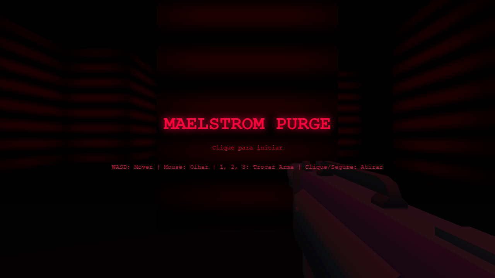 | 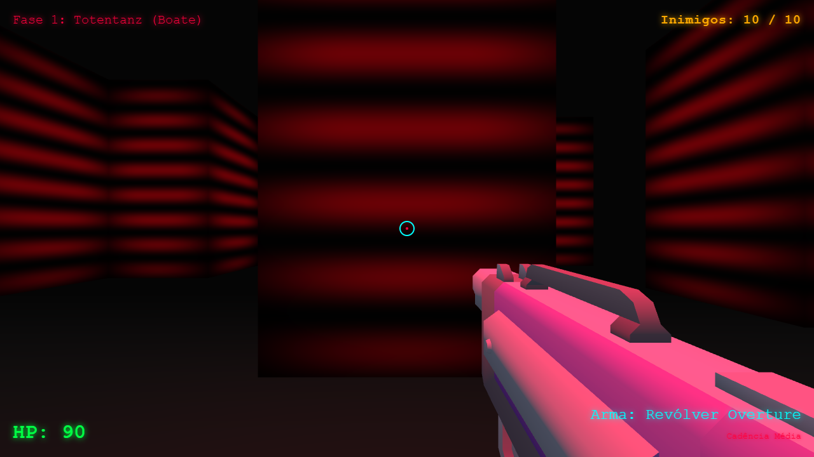 | 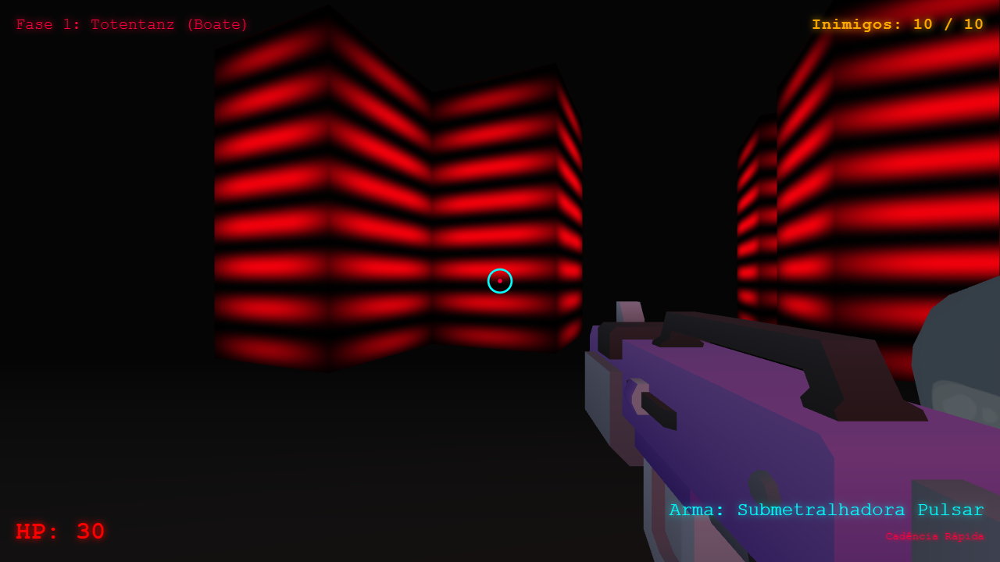 | 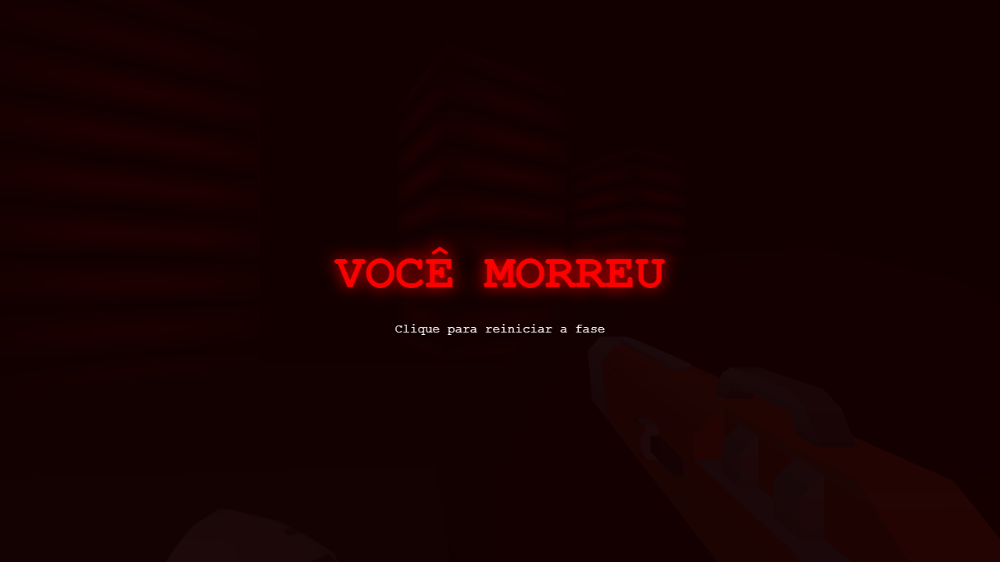 |

O que se via no vídeo:
- **WebGL**: não cumpre o pré-requisito;
- um único mapa de blocos listrados, sem objetivo, e 10 zumbis lentos que **quase não aparecem** no escuro;
- o jogador perdeu 70 de HP sem conseguir matar nenhum (não dava para vê-los) e morreu;
- as armas ocupavam metade da tela.

### O que a IA fez (resumo da resposta)
1. **Investigou os assets antes de codar:** leu o JSON interno dos `.glb` e o cabeçalho dos `.fbx`. Descobriu que
   **não há animações** (a versão gratuita não traz) e que os modelos estão em **T-pose**, com ossos no padrão
   da Unreal (`thigh_l`, `upperarm_r`…). Também conferiu tamanhos e orientação das 7 armas.
2. **Testou a hipótese mais arriscada primeiro:** montou uma página de teste (`viewer.html`, depois apagada)
   para confirmar que o WebGPU funciona e que um **rig procedural** consegue animar os três esqueletos
   (Imp, Puglin e o zumbi antigo).
3. **Reescreveu o jogo em módulos** (antes era um único `main.js` de 648 linhas):

| Módulo | Responsabilidade |
|---|---|
| `src/engine/renderer.js` | `WebGPURenderer`, duas passadas (mundo + arma), bloom e vinhetas |
| `src/engine/audio.js` | sons procedurais + **trilha "metal" gerada em tempo real** que acelera no combate |
| `src/engine/input.js` | mouse/teclado com Pointer Lock |
| `src/shaders/*.js` | todos os shaders em TSL (ver [`SHADERS.md`](SHADERS.md)) |
| `src/game/level.js`, `levels.js` | mapas em ASCII, colisão por grade, **raycast DDA 3D**, **campo de fluxo (BFS)** para a IA |
| `src/game/rig.js` | animação procedural de ossos, independente dos eixos de cada modelo |
| `src/game/enemies.js` | 5 tipos de inimigo, IA, ataques, atordoamento e execução |
| `src/game/weapons.js` | 6 armas: hitscan, chumbo, projétil com dano em área, perfurante, corrente elétrica |
| `src/game/player.js` | movimento rápido estilo Doom, dash, pulo, armadura |
| `src/game/projectiles.js`, `pickups.js`, `effects.js` | bolas de fogo desviáveis, itens, partículas |
| `src/ui/hud.js`, `index.html`, `style.css` | HUD estilo Doom e telas |

### Depois
🎥 [`prints/cap07/depois.mp4`](prints/cap07/depois.mp4) — menu + trechos das 4 fases + chefe.
**Atenção na apresentação:** nas gravações quem joga é um **bot de mira automática**
([`tools/captura/bot.js`](../tools/captura/bot.js)); nas fases 3 e 4 ele estava invencível para chegar ao chefe.

| Menu | Fase 1 — Totentanz | Fase 2 — Depósito |
|---|---|---|
| 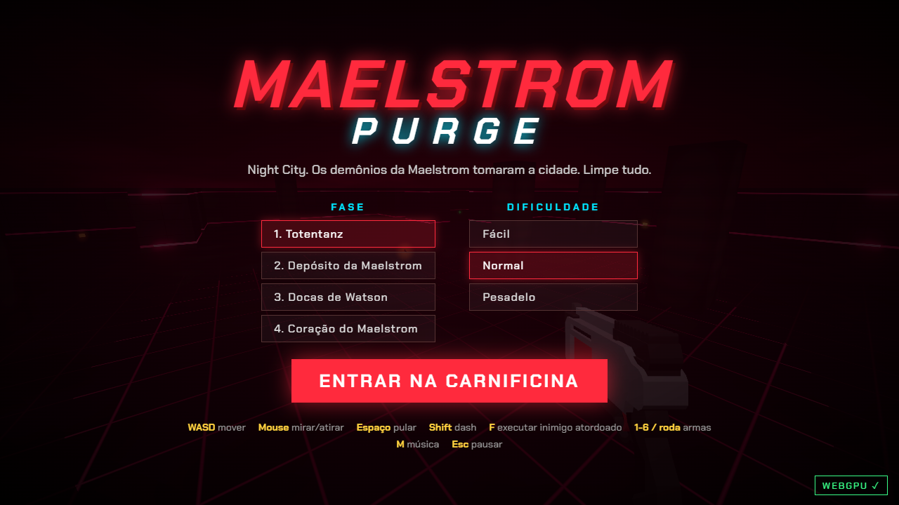 | 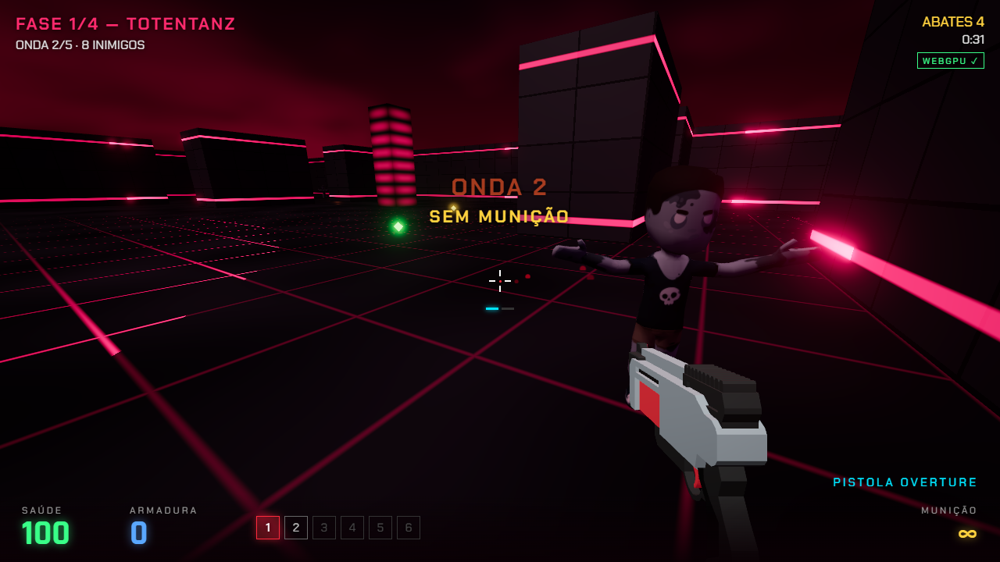 | 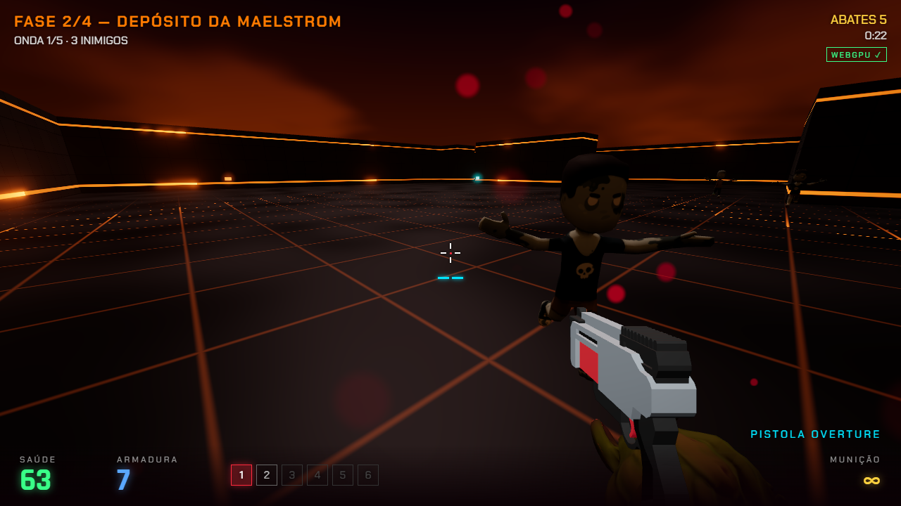 |
| **Fase 3 — Docas de Watson** | **Fase 4 — Coração do Maelstrom** | **Chefe: Arquidemônio** |
| 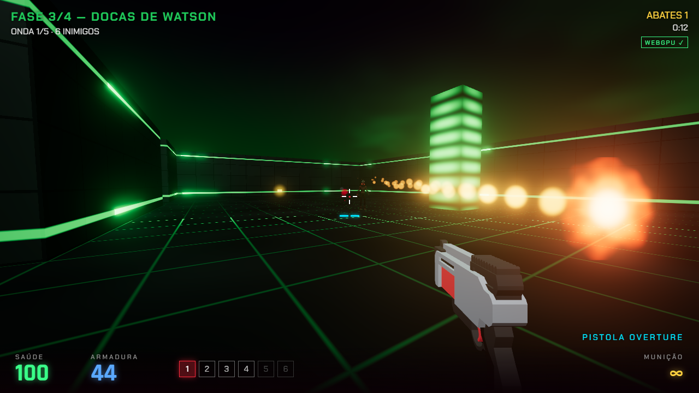 | 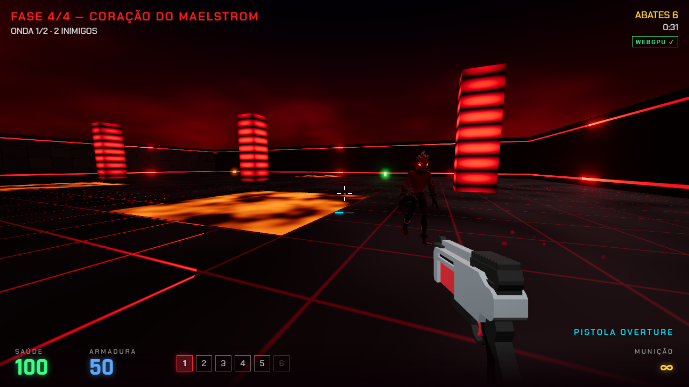 | 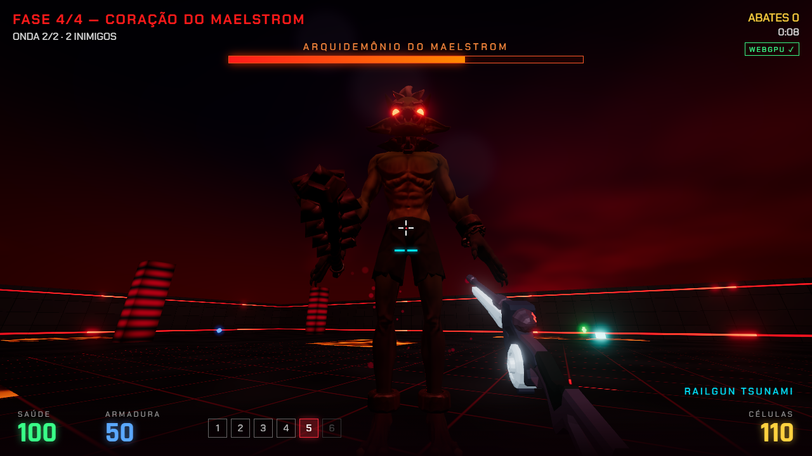 |
| **Inimigo atordoado ([F])** | **Execução** | **As 6 armas** |
| 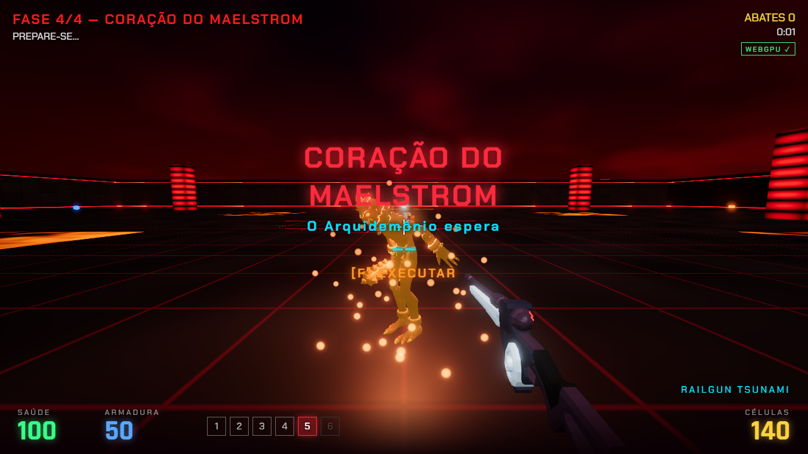 | 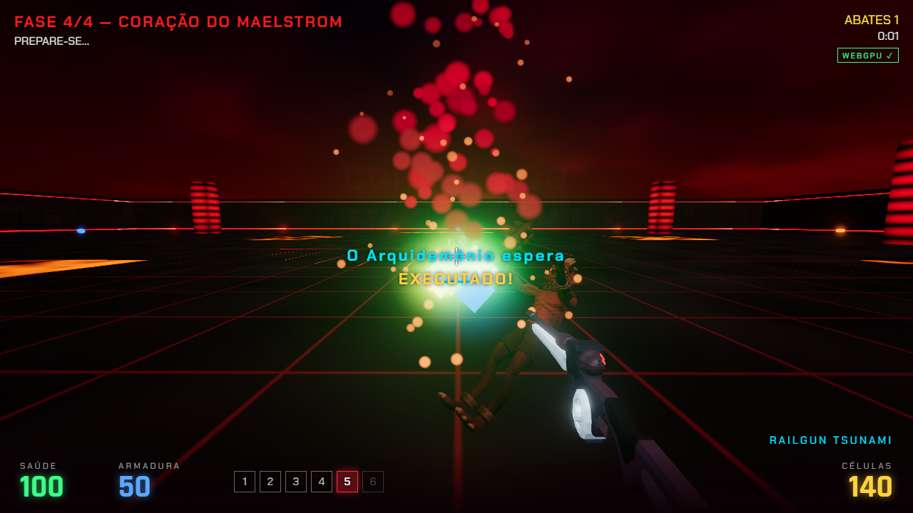 | 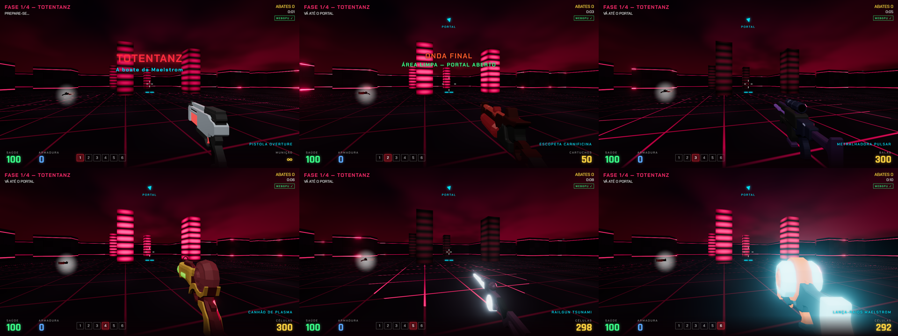 |

Mudanças de jogabilidade (o "estilo Doom"):
- **4 fases** com mapas próprios, cor própria e **ondas** de inimigos. Ao limpar a última onda, um **portal**
  abre e uma bússola no HUD aponta para ele. Tela de estatísticas ao fim de cada fase (abates, execuções,
  precisão, dano, tempo).
- **5 inimigos:** Zumbi (lento, aguenta dano), Puglin (rápido, dá um bote), Imp (arremessa **bolas de fogo
  visíveis e desviáveis**, mantém distância e anda de lado), Imp de Elite (roxo, 3 bolas em leque) e o
  **Arquidemônio** (chefe de 6 m com barra de vida). O chefe arremessa rajadas, dá uma **pancada no chão com
  onda de choque** (pule para desviar) e, abaixo de 50% de vida, fica furioso e **invoca Puglins**.
- **6 armas** que se ganham ao longo das fases: pistola (munição infinita), escopeta (9 chumbos, empurra),
  metralhadora, canhão de plasma (explode em área), railgun (atravessa vários inimigos) e lança-raios
  (salta entre 3 inimigos). **Tiro na cabeça** causa 1,5× de dano.
- **Execuções** (inspiradas em Doom Eternal): com pouca vida o inimigo fica **atordoado** e brilha laranja.
  Apertar **F** perto dele o executa e solta vários orbes de vida. Matar inimigos também derruba munição e
  vida, o que **recompensa jogar agressivo**.
- **Movimento rápido:** 10,5 m/s, **dash** com 2 cargas (Shift), pulo, recuo de câmera, tremor de tela,
  balanço da arma e FOV que abre em alta velocidade.
- **Sensação de impacto:** *hitstop* (o jogo congela por 50–90 ms nos golpes fortes), hitmarker (X vermelho
  quando mata), setas indicando de onde veio o dano, sangue com física, inimigos se desfazendo com o shader
  de dissolução.
- **Dificuldade:** Fácil, Normal e Pesadelo. O Normal foi calibrado com o bot: na fase 2, em 70 s, ele
  tomou 124 de dano, curou-se com os orbes e terminou com 86 de HP. Ou seja, ameaça sem ser injusto.
- **Áudio** 100% procedural, com trilha que fica mais intensa quando há inimigos vivos (tecla M liga/desliga).

**Bugs do Capítulo 6 resolvidos:**
| # | Bug | Como ficou |
|---|---|---|
| B1 | Zumbis atacavam com o jogo pausado | Pausa real: nada é atualizado fora do estado `playing` (testado: as posições ficam idênticas após 2 s de pausa) |
| B2 | Tiro atravessava parede | Raycast DDA 3D na grade: o tiro para na parede, no pilar, no caixote ou no chão |
| B3 | Zumbis travavam nas quinas | Campo de fluxo (BFS) recalculado quando o jogador muda de célula: os inimigos contornam obstáculos |
| B4 | Renascia no lugar onde morreu | Morrer reinicia a fase no ponto `S`, com o equipamento que se tinha ao entrar nela |
| B5 | Não havia vitória | Ondas → portal → próxima fase → chefe → tela "MAELSTROM PURGADA" |
| B6 | Falha de carregamento silenciosa | Barra de progresso e tela de erro listando o arquivo que faltou; aviso se o navegador não tem WebGPU |

### Erros e acertos durante o desenvolvimento
Todos os erros abaixo aconteceram de verdade nesta sessão, na ordem em que apareceram.

| # | Erro / problema (evidência) | Diagnóstico | Correção |
|---|---|---|---|
| E1 | A extensão do Chrome para a IA controlar o navegador estava **desconectada**: não dava para gravar o "antes" pelo navegador do usuário | — | Gravação com **Edge headless + puppeteer**. Como o headless não tem Pointer Lock, a API foi **simulada** no script ([`tools/captura`](../tools/captura/README.md)) |
| E2 | Os modelos novos **não têm animação** e estão em T-pose | Descoberto lendo o JSON do `.glb` | Rig procedural com rotações no espaço do modelo, `L' = P⁻¹·D·P·L`: funciona com os eixos de qualquer exportador. Validado primeiro numa página de teste |
| E3 | Risco: o Vite só copia assets referenciados por **string literal** em `new URL()` | Percebido antes de quebrar (a primeira versão usava template string com variável) | Caminhos escritos por extenso; `npm run build` confirmou os `.glb`/`.fbx` em `dist/` |
| E4 | Tela de carregamento eterna. Console: `TypeError: max is not a function` | **1ª hipótese (errada):** encadear `.max()` em nó TSL no shader do chão. Corrigido, mas o erro **continuou**. Adicionado o *stack trace* ao script de captura → a linha 88 de `entities.js` mostrou o real culpado: o parâmetro `max` do construtor encobria a função `max()` do TSL | Parâmetro renomeado para `capacity` |
| E5 | `THREE.TSL: No stack defined for assign operation. Make sure the assign is inside a Fn()` | `assign` fora de um `Fn()` no shader das partículas | Posição montada dentro de `Fn()` |
| E6 | (preventivo) `smoothstep` com bordas invertidas | Indefinido no WGSL (o S1 original tinha isso) | `1 - smoothstep(...)` |
| E7 | 1º print do jogo novo: céu claro demais, paredes pretas, linhas do chão serrilhadas "piscando" ao longe, halos de itens estourando em branco | Bloom amplificando emissivos e linhas finas | Céu mais escuro, paredes mais claras, linhas mais finas que **somem com a distância**, halos mais fracos |
| E8 | Explosões de bolas de fogo perto da câmera **tampavam a tela** — [`erro_explosao_tampando_tela.png`](prints/cap07/erro_explosao_tampando_tela.png) | Muitas partículas grandes de fumaça + clarão; partículas coladas na lente | Menos e menores partículas; **fade perto da câmera** no shader |
| E9 | Clarão da escopeta cobria a arma; railgun e lança-raios estouravam em branco — [`depois_armas.png`](prints/cap07/depois_armas.png) | Sprite do clarão grande demais; emissivos fortes demais nas armas | Clarão menor; emissivo 0,8 → 0,25; lança-raios reposicionado |
| E10 | Rastro das bolas de fogo do chefe deixava a tela laranja; barra do chefe por cima do nome da fase — [`erro_rastro_chefe_ofuscante.png`](prints/cap07/erro_rastro_chefe_ofuscante.png) | Rastro proporcional ao tamanho (2,2×) + aditivo ×3 | Rastro limitado, aditivo ×1,8, bolas do chefe 1,5×, barra descida; vida do chefe 4200 → 3300 |
| E11 | Fase 3 "estourava" de verde — [`erro_fase3_estourada.png`](prints/cap07/erro_fase3_estourada.png) | Verde neon puro (`#39ff14`) tem luminância altíssima | Paleta da fase suavizada e ácido menos brilhante |
| E12 | **Losango verde gigante grudado na câmera** — [`erro_orbe_grudado_na_camera.png`](prints/cap07/erro_orbe_grudado_na_camera.png) | Orbe de vida atraído pelo ímã até o olho do jogador, mas com a vida cheia não podia ser coletado. Achado junto: um orbe parado no chão **nunca** era coletado (a distância era medida até o olho, a 1,7 m) | O ímã só atua se o jogador puder usar o item (`canCollect`); coleta também pela distância horizontal |
| E13 | Começar na fase 4 com 5 armas e estar segurando a pistola | Arma atual não era reavaliada ao carregar a fase | Ao entrar na fase, seleciona a melhor arma com munição |
| E14 | `404 (Not Found)` no console | Favicon não referenciado no HTML novo | `<link rel="icon" href="/favicon.svg">`. O console final ficou **sem erros** ([`depois_console.txt`](prints/cap07/depois_console.txt)) |
| E15 | Ferramentas: ffmpeg não achava os frames (caminho relativo); o servidor do Vite foi encerrado após 30 min em segundo plano | — | Caminhos absolutos; servidor reiniciado |
| E16 | HUD aparecia "fantasma" atrás das telas de pausa e de fim de fase | — | HUD escondido quando há tela sobreposta |

**Acertos que valem destacar:**
- Ler o conteúdo dos assets antes de programar evitou dias de tentativa e erro com a animação.
- Testar cada sistema com um **bot automatizado** (e não só "olhar se compila") revelou E8–E13, que nenhum
  build acusaria.
- Todos os fluxos foram verificados com script: pausa congela (B1), morrer reinicia a fase, o portal leva à
  próxima fase, e o build de produção (`npm run build` + `preview`) carrega os assets.

### Métricas (Edge headless, 1280×720, GPU integrada do notebook)
| Teste | Resultado |
|---|---|
| Backend | **WebGPU** (selo verde no menu e no HUD) |
| FPS médio durante combate | ~46–54 fps (gravando vídeo ao mesmo tempo) |
| Fase 1, 60 s, bot, Normal | 10 abates, 28 de dano recebido, escopeta coletada, onda 2 de 5 |
| Fase 2, 70 s, bot, Normal | 16 abates, 2 execuções, 124 de dano recebido, terminou com 86 HP |
| Erros no console (versão final) | 0 |

---

## Capítulo 8 — Publicação no GitHub Pages
**Data:** 2026-10-04 · **IA usada:** Claude Code (Claude Opus 5.5)

**Prompts (do grupo):** "faça commit em um repositorio novo, no meu github brunocosta800" → "agora, hospede no github pages"

**Antes:** o jogo só rodava localmente (`npm run dev`).
**Depois:** publicado em **https://brunocosta800.github.io/maelstrom-purge/**. Cada push na `main` gera um build e
publica sozinho (`.github/workflows/deploy.yml`). O GitHub Pages usa HTTPS, que é obrigatório para o WebGPU funcionar.

**Erros e correções:**
| Problema | Causa | Correção |
|---|---|---|
| GitHub CLI (`gh`) não instalado: a IA não conseguia criar o repositório | — | O repositório foi criado pelo site, vazio; a IA adicionou o remote `bruno` e fez o push (o `origin` do colega ficou intacto) |
| (preventivo) Arquivos não seriam encontrados no Pages | O site fica em `/maelstrom-purge/`, mas o código pedia `/characterMedium.fbx`, `/favicon.svg`… (raiz do domínio) | `vite.config.js` com `base: './'` e `import.meta.env.BASE_URL` para os arquivos de `public/`. Testado servindo o build num subcaminho local antes de publicar |

---

## Capítulo 9 — As paredes invisíveis
**Data:** 2026-10-04 · **IA usada:** Claude Code (Claude Opus 5.5)

**Prompt (do grupo):** "tem algumas paredes invisiveis nas fases"

**Antes:** em várias fases o jogador batia em obstáculos que não apareciam na tela. Os tiros também paravam no ar.

| Antes: fase 2, nada à frente, mas bloqueia | Depois: o caixote aparece |
|---|---|
| 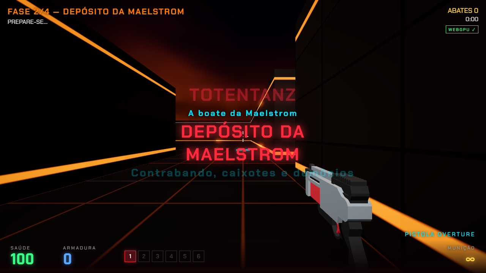 | 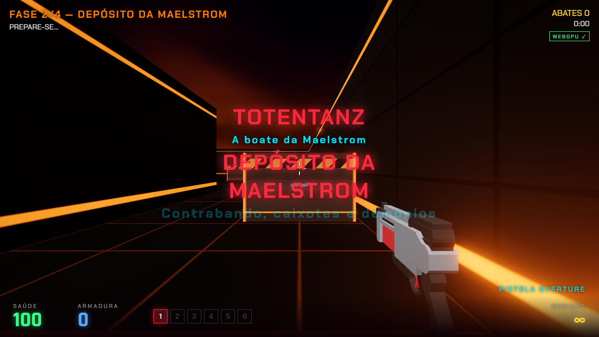 |

**Investigação (sem adivinhar):** a IA escreveu um teste ([`tools/captura/cen_walls.mjs`](../tools/captura/cen_walls.mjs))
que, em cada fase, compara a **grade de colisão** com as **malhas desenhadas** e lista toda célula sólida que encosta
no chão e não tem malha. Resultado: **os caixotes (`c`) nunca eram desenhados, em nenhuma fase** (6 na fase 1,
24 na fase 2, 11 na fase 3 e 4 na fase 4). A colisão deles existia, então eram literalmente paredes invisíveis.

**Causa: precisão de ponto flutuante.** A altura de cada célula ficava num `Float32Array`. O tipo da célula era
deduzido da altura com `h === 2.2`, mas em 32 bits o 2,2 vira `2.200000047683716`: a comparação dava falso e o caixote
nunca entrava na lista de desenho. O mesmo teste errado fazia a colisão e o tiro tratarem o caixote como um bloco
de 4 m (o visual tem 3,6 m). Paredes (6) e totens (8) funcionavam porque são representados exatamente.

**Correções:**
1. Cada célula ganhou um **tipo explícito** (`kind`: chão, parede, totem, caixote). Altura e recuo vêm de tabelas
   indexadas por esse tipo, e nenhuma lógica compara número de ponto flutuante com `===`.
2. Paredes que só encostam no chão pela diagonal (cantos) também passaram a ser desenhadas, para não sobrar fresta.
3. **Segundo problema, visto no print intermediário** ([`meio_caixote_escuro.png`](prints/cap09/meio_caixote_escuro.png)):
   depois de corrigido, o caixote aparecia, mas era tão escuro que ainda parecia invisível. O material foi refeito:
   metal mais claro, faixa de perigo amarela e preta no topo e cantos em neon na cor da fase.

**Verificação:** o mesmo teste rodou de novo nas 4 fases e listou **0 células sólidas sem malha** e **0 pontos de
colisão fantasma**. O build passou.

| Fase 1 | Fase 3 |
|---|---|
| 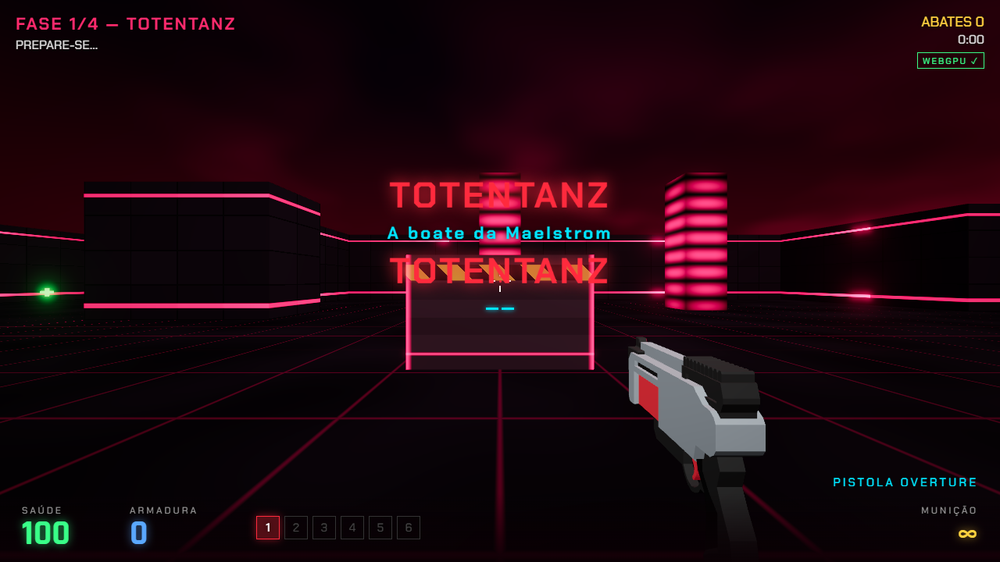 | 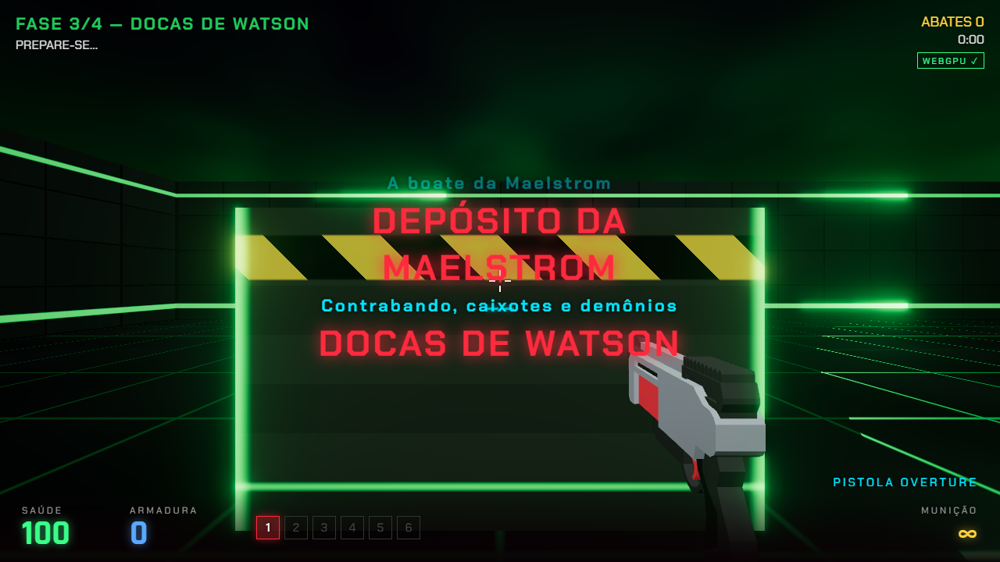 |

**Por que passou despercebido no capítulo 7:** os testes com o bot olhavam para inimigos e efeitos. Ninguém conferiu
se cada obstáculo do mapa tinha uma malha. Fica a lição: **testar o que não aparece** (comparar colisão × visual), e
não só o que aparece.

---

## Comparação entre IAs

| Aspecto | Gemini (cap. 1) | Gemini / outro Claude (cap. 2–5) ⟨confirmar⟩ | Claude Code (cap. 6–9) |
|---|---|---|---|
| Como foi usado | Um prompt grande pedindo o jogo inteiro | Um prompt por funcionalidade + prompts de correção com o erro colado | Prompts por etapa + prompt-mestre + `CLAUDE.md` |
| Pré-requisito WebGPU | Gerou **WebGL** (o prompt dizia "webgpl", ambíguo) | Manteve WebGL; shaders em GLSL | Detectou o problema e migrou tudo para WebGPU/TSL |
| Fidelidade ao pedido | Entregou base FPS, shader e 3 fases; **faltaram inimigos e a espada** | Cap. 5: HP do jogador, sangue (S2) e flash de dano (S3) | Entregou o pedido do cap. 7 inteiro (fases, dificuldade, chefe) |
| Planejamento | — | ⟨confirmar se o `implementation_plan.md` do cap. 3 foi desta IA⟩ | Leu os assets e testou o rig antes de escrever o jogo |
| Testes | O grupo rodava e relatava o erro (tela preta, console) | O grupo rodava e relatava (skin deslocada, flash global) | Build + navegador headless + bot jogando + teste colisão × visual |
| Erros notáveis | Termo ambíguo virou a tecnologia errada | flipY invertido, flash fraco, avisos de erro removidos | 20+ registrados (ex.: `max is not a function`, caixotes invisíveis por precisão de float) |

**Conclusão parcial:** o resultado dependeu mais do **contexto dado** do que da IA. Com um prompt único e ambíguo
("webgpl"), o Gemini gerou WebGL. Com o requisito escrito explicitamente (prompt-mestre e `CLAUDE.md`), o Claude Code
manteve WebGPU em todas as etapas.

---

## Checklist para o dia da apresentação
- [ ] Navegador com WebGPU (Chrome ou Edge atualizados). Conferir em `chrome://gpu` → "WebGPU: Hardware accelerated"
- [ ] `npm install` e depois `npm run dev` (ou `npm run build` + `npm run preview`) no computador da apresentação
- [ ] Menu mostra o selo verde **WEBGPU ✓** (amarelo "WEBGL2 (fallback)" = o navegador não está usando WebGPU)
- [ ] Console sem erros (F12)
- [ ] Sem internet as fontes caem para a reserva; o jogo funciona igual
- [ ] Roteiro de demo sugerido: menu → Fase 1 (ondas, escopeta, execução com F) → menu → Fase 4 (chefe: onda de choque e fúria)
- [ ] Versão online: https://brunocosta800.github.io/maelstrom-purge/ (abrir antes para o navegador baixar os ~25 MB de modelos)
- [ ] Ter os vídeos `antes.mp4` e `depois.mp4` de reserva caso o PC da apresentação não tenha WebGPU
