# Registro de Shaders — origem, adaptações e integração

> Critério de avaliação: "Registro da origem do shader, das adaptações feitas e de sua integração à aplicação" (1,0 pt).

## Contexto: de GLSL/WebGL para TSL/WebGPU (Capítulo 7)
Até o commit `ec79988` o jogo usava `THREE.WebGLRenderer` e três shaders em **GLSL**
(`ShaderMaterial` e `onBeforeCompile`). O pré-requisito do trabalho é **WebGPU**, e o
`WebGPURenderer` **não aceita GLSL**: não existe `ShaderMaterial` nem `onBeforeCompile`.

Todos os shaders foram reescritos em **TSL (Three Shading Language)**, a linguagem de nós do
Three.js r186. Em tempo de execução o TSL é compilado para **WGSL**, a linguagem de shader do WebGPU.
Por isso os shaders ficam em arquivos `.js`: cada função monta um grafo de nós (`sin`, `mix`,
`smoothstep`, …) que vira código WGSL.

| Arquivo | Conteúdo |
|---|---|
| `src/shaders/world.js` | cenário: S1 totem, S4 paredes, caixotes, S5 chão, S6 lava/ácido, S7 céu |
| `src/shaders/entities.js` | S3 inimigos, S2 partículas, S8 bolas de fogo, S9 portal, traçantes, halos, onda de choque |
| `src/engine/renderer.js` | S10 pós-processamento (bloom + vinhetas) |

**Resumo da origem:** S1 (commit inicial) e S2 e S3 (capítulo 5) foram gerados pelo **Gemini**. Os três eram GLSL/WebGL e foram convertidos para TSL/WebGPU pelo Claude Code no capítulo 7. Os shaders S4–S10 foram escritos pelo Claude Code no
capítulo 7. O bloom é o `BloomNode` dos exemplos oficiais do Three.js (licença MIT).

Uniforms compartilhados (`world.js`): `gameTime` (tempo do jogo, **congela no pause**), `accent` e
`accent2` (cores da fase atual). Trocar a fase troca as cores de todos os shaders de uma vez.


## Galeria: cada shader isolado
Geradas com o estúdio [`tools/captura/shaders.html`](../tools/captura/shaders.html), que renderiza um shader por vez
com o código real do jogo (`node tools/captura/amostras.mjs docs/shaders`).

| Totem (S1, do Gemini) | Paredes (S4) | Caixotes |
|---|---|---|
| 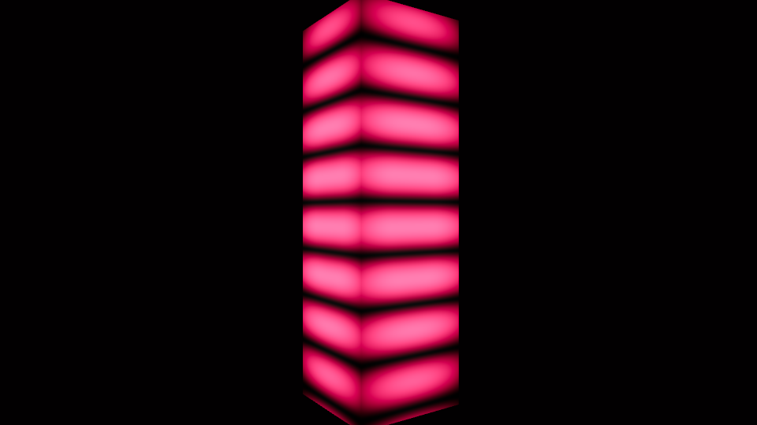 | 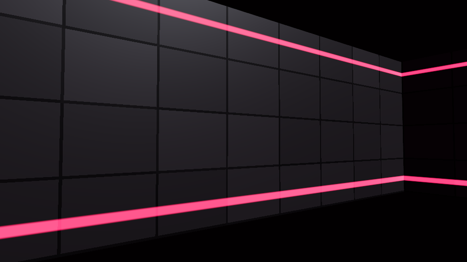 | 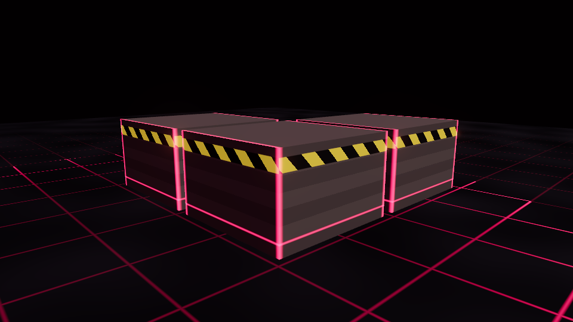 |
| **Chão (S5)** | **Lava / ácido (S6)** | **Céu (S7)** |
| 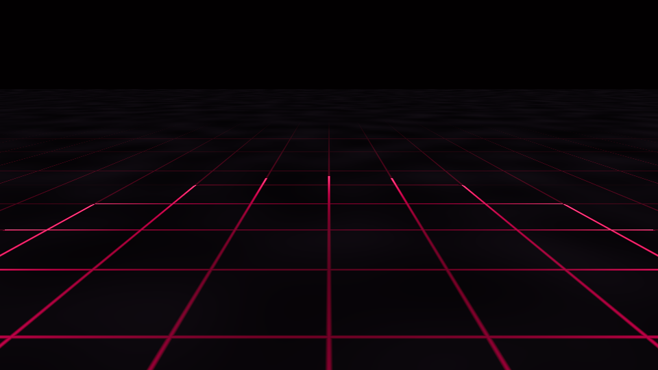 | 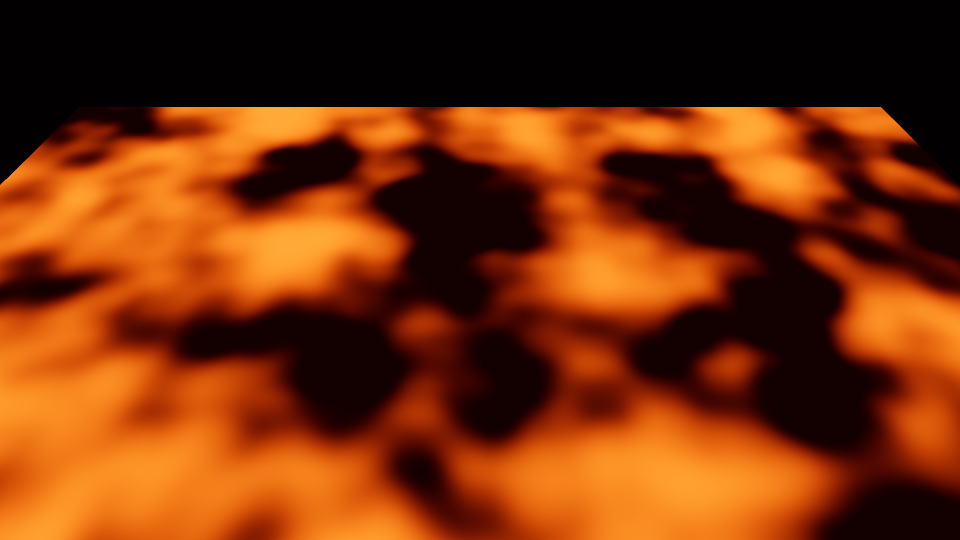 | 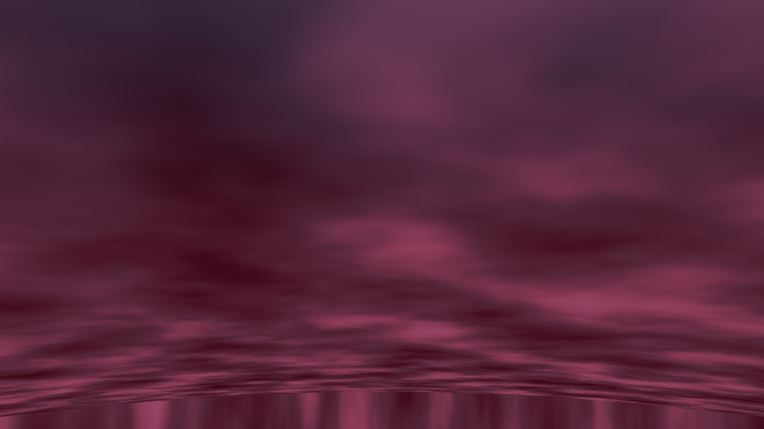 |
| **Partículas (S2, do Gemini)** | **Bolas de fogo (S8)** | **Portal (S9)** |
| 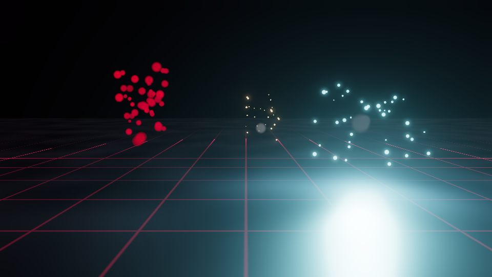 | 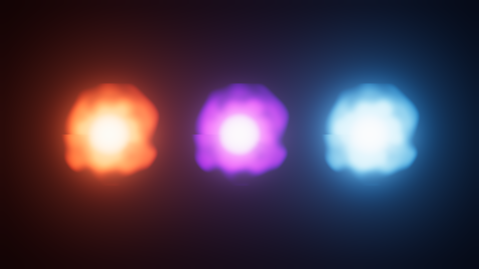 | 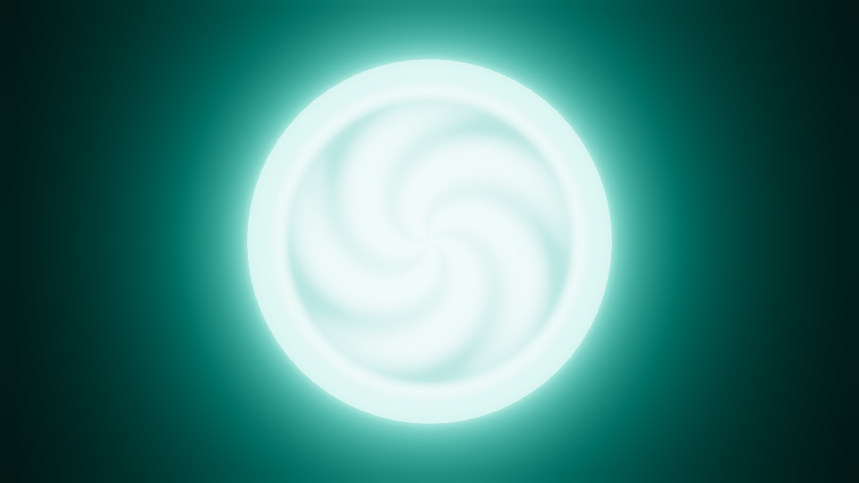 |
| **Raios e traçantes** | **Onda de choque** | |
| 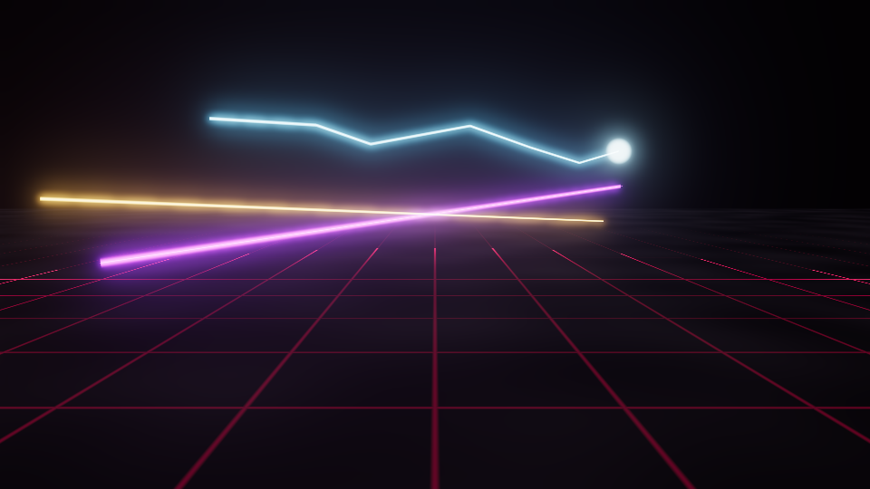 | 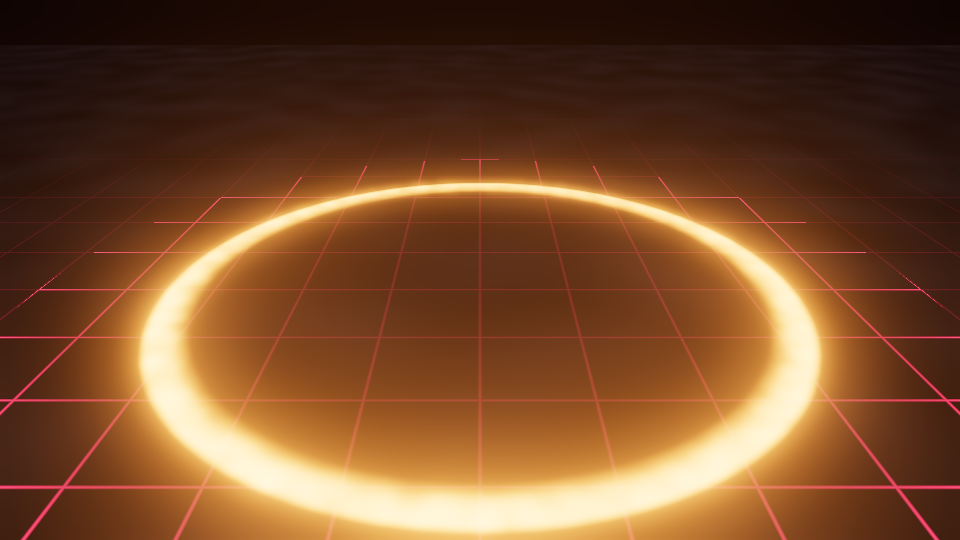 | |

**Material dos inimigos (S3, do Gemini, evoluído):** normal · flash de dano · atordoado · dissolvendo

| 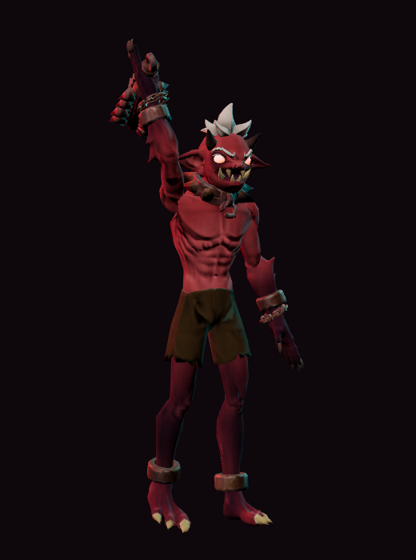 | 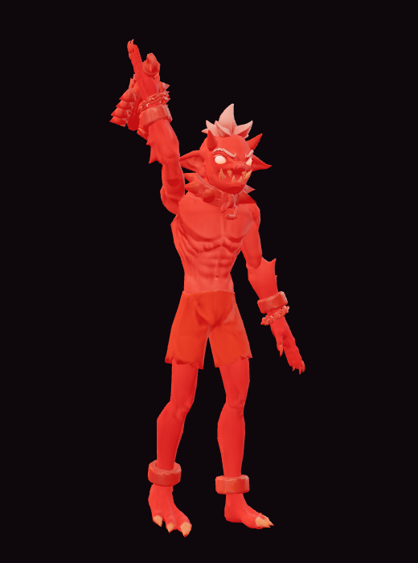 |  | 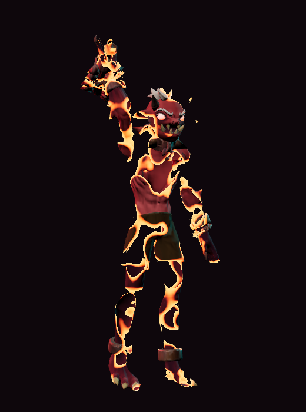 |
|---|---|---|---|

**Pós-processamento (S10):** normal com bloom · dano · cura · pausa

| 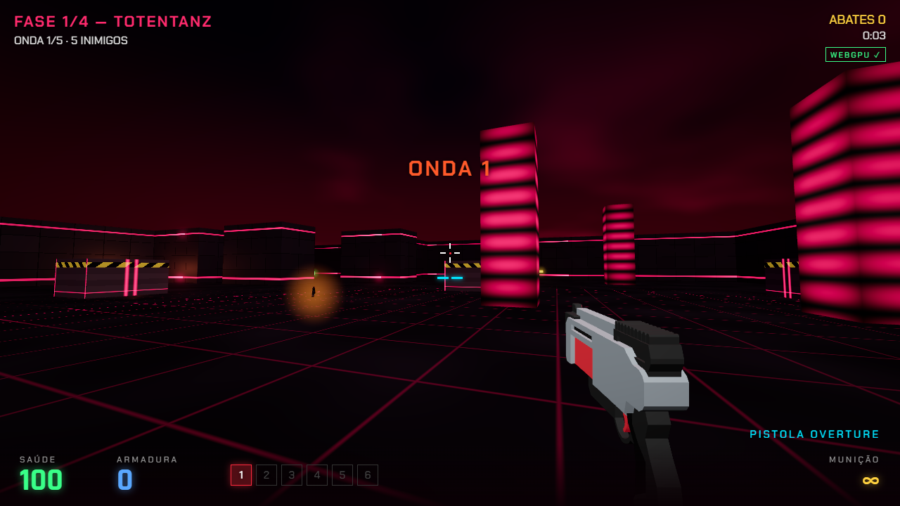 | 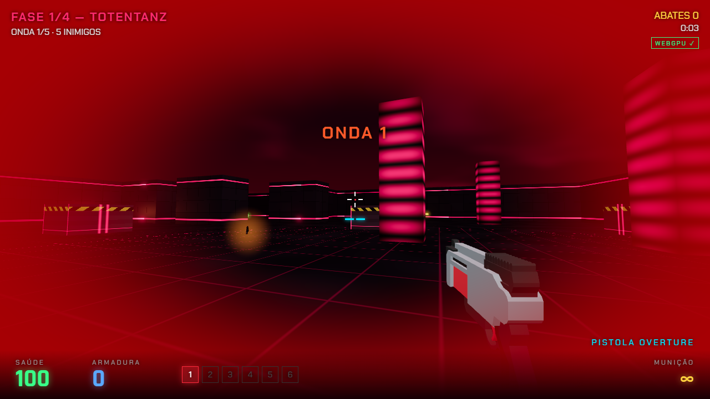 | 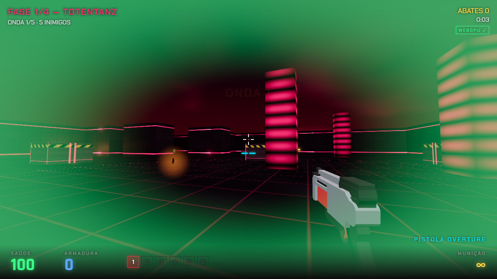 | 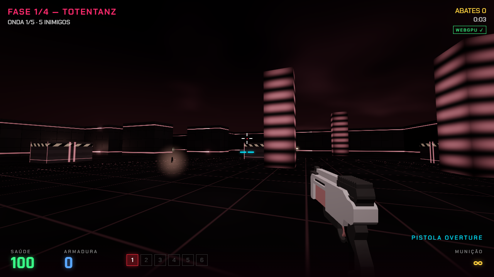 |
|---|---|---|---|

---

## Shaders herdados do jogo original (portados)

### S1 — Grade neon pulsante → "Totem" (`neonTotemMaterial`)
- **Origem:** **Gemini**, no commit inicial `2252980`, em GLSL, a partir do prompt que pedia "algum efeito de shader" (ver capítulo 1 do diário e `documentacao_jogo.md`).
- **Original (GLSL):**
  ```glsl
  float grid  = sin(vUv.y * 50.0 + time * 5.0) * 0.5 + 0.5;
  float pulse = sin(time * 2.0) * 0.5 + 0.5;
  vec3 finalColor = mix(color2, color1, grid * pulse);
  finalColor *= smoothstep(0.8, 0.2, distance(vUv, vec2(0.5)));
  gl_FragColor = vec4(finalColor, 1.0);
  ```
- **Porte para TSL (fiel, mesma matemática):**
  ```js
  const grid = sin(vUv.y.mul(50.0).add(gameTime.mul(5.0))).mul(0.5).add(0.5);
  const pulse = sin(gameTime.mul(2.0)).mul(0.5).add(0.5);
  const finalColor = mix(color2, accent, grid.mul(pulse));
  return finalColor.mul(oneMinus(smoothstep(0.2, 0.8, distance(vUv, vec2(0.5))))).mul(2.2);
  ```
- **Adaptações:**
  1. `smoothstep(0.8, 0.2, x)` com a borda inicial maior que a final é **indefinido** em GLSL e WGSL.
     Foi trocado por `1 - smoothstep(0.2, 0.8, x)`, que é o efeito pretendido.
  2. ×2,2 no final, para o neon alimentar o bloom do pós-processamento.
  3. `color1` deixou de ser fixo (`0xff003c`) e virou a cor da fase (`accent`).
- **Integração:** material dos **totens** (`P` nos mapas), instanciados com `InstancedMesh` em `Level.build()`.
  Preserva a "identidade" visual do jogo antigo dentro do novo.

### S2 — Partículas de sangue → sistema de partículas na GPU (`GPUParticles`)
- **Origem:** commit `ec79988`, em GLSL, a partir do prompt "crie um efeito de flash e um efeito de partículas de sangue… utilizando shaders". IA: **Gemini**.
- **Original:** a cada tiro, um `THREE.Points` com um `ShaderMaterial` **novo**, e física no vertex shader:
  `pos = position + velocity*t; pos.y -= 25*t²/2; alpha = 1 - 2t; gl_PointSize = 15*(10/-z)`.
- **Problemas no WebGPU:**
  1. não existe `gl_PointSize`: pontos têm sempre 1 pixel;
  2. criar um material por tiro obriga a compilar um pipeline novo, o que trava o jogo.
- **Solução (evolução):** **um único** `Sprite` instanciado (`sprite.count = 4000–6000`) com um
  **buffer circular** de atributos por instância. A CPU só escreve a origem, a velocidade, o instante de
  nascimento, a cor e o tamanho, e sobe para a GPU apenas o trecho do buffer que mudou (`addUpdateRange`).
  A GPU calcula a trajetória, a mesma ideia do original:
  ```js
  const age = gameTime.sub(o.w);                         // tempo desde o nascimento
  const travel = oneMinus(exp(drag.mul(tt).negate())).div(drag);   // arrasto do ar (novo)
  pos = o.xyz + v.xyz*travel - (0, g*tt²/2, 0)           // gravidade (como no original)
  pos.y = mix(pos.y, max(pos.y, 0.03), stick)            // sangue empoça no chão (novo)
  ```
- **Adaptações extras:** arrasto, gravidade e cor por partícula, crescimento ou encolhimento ao longo da vida,
  modo aditivo (faíscas, fogo, plasma) e normal (sangue, fumaça), e desaparecimento perto da câmera
  (`smoothstep(0.5, 2.2, -positionView.z)`) para uma partícula colada na lente não tampar a tela.
- **Integração:** `src/game/effects.js` usa dois sistemas (`blood` e `glow`) para sangue, gibs, faíscas na
  parede, explosões, rastro dos projéteis e a coluna de surgimento dos inimigos.

### S3 — Flash vermelho de dano → material dos inimigos (`enemyMaterial`)
- **Origem:** commit `ec79988`, mesmo prompt do S2, também no **Gemini**, como injeção de GLSL com `onBeforeCompile`:
  `gl_FragColor = mix(gl_FragColor, vec4(1,0,0,1), hitMix);`
- **Problema:** `onBeforeCompile` não existe no WebGPU.
- **Reescrita em TSL:** `MeshStandardNodeMaterial` com `colorNode` e `emissiveNode`. Mantém o mesmo
  "mix para vermelho" (`mix(base, vermelho, hit*0.8)`) e acrescenta:
  1. **uniforms por objeto** (`uniform(0).onObjectUpdate(({object}) => object.userData.hit)`): **um material
     por tipo** serve todos os inimigos, e cada um tem seu próprio flash. Antes era um material por inimigo;
  2. **dissolução por ruído 3D** (`mx_noise_float(positionLocal * escala)` + `Discard()`) com **borda
     incandescente**, usada no **surgimento** (o inimigo se materializa) e na **morte** (o corpo se desfaz);
  3. **pulso laranja de "atordoado"** quando o inimigo pode ser executado (tecla F);
  4. olhos brilhando: `T_*_Emissive.png` do pacote Quaternius × cor do tipo (vermelho, roxo para elite, laranja para o chefe).
- **Integração:** `prepareEnemyTemplates()` em `src/game/enemies.js`. A escala do ruído é calculada pela
  altura da malha (`11 / alturaGeometria`), então o padrão é igual no zumbi (FBX em cm) e no Imp (GLB em m).

---

## Shaders novos (Capítulo 7)
Origem: **escritos pela IA (Claude) para este projeto**, usando as funções do TSL do Three.js r186.
Não foram copiados de exemplos externos.

| # | Shader | Técnica de CG | Integração |
|---|---|---|---|
| S4 | **Painéis das paredes** (`wallMaterial`) | Coordenadas da face a partir de `positionWorld` e `normalWorld` (não usa UV); `hash` para variar o tom de cada painel; faixas neon com "pulso de dados" animado (`pow(fract(x - t), 10)`) | `InstancedMesh` só das paredes visíveis |
| — | **Caixotes** (`crateMaterial`) | Listras de perigo diagonais com `step(fract(x+y))` | Fase 2 |
| S5 | **Chão** (`floorMaterial`) | Grade de 2 m com linhas emissivas, sujeira com ruído (rugosidade variável), onda de energia saindo do centro, **fade pela distância da câmera** (sem serrilhado no horizonte) | Plano único por fase |
| S6 | **Lava / ácido** (`lavaMaterial`) | Ruído fractal (`mx_fractal_noise_float`, 3 oitavas) animado em 3D (x, z, tempo) | Células `L`; dano ao pisar |
| S7 | **Céu infernal** (`skyNode`) | `scene.backgroundNode`: degradê por `positionWorldDirection.y`, nuvens com ruído fractal projetado, clarões de relâmpago aleatórios | Fundo de todas as fases |
| S8 | **Bola de fogo / plasma** (`orbMaterial`) | Coordenadas polares + ruído "fervendo" na borda; núcleo branco, borda colorida; mistura aditiva | Projéteis dos imps (fogo e "void" roxo) e do jogador (plasma), clarão do cano |
| S9 | **Portal de saída** (`portalMaterial`) | Espiral polar animada `sin(5·ângulo + 14·raio − 5t)`; o uniform `portalOpen` passa de "fechado" (anel vermelho) para "aberto" (ciano) | Abre quando a última onda morre |
| — | **Traçantes / raios** (`beamMaterial`) | Dois planos cruzados ao longo de +Z; núcleo brilhante por `abs(uv.x−0.5)`; fade por objeto | Tiros, railgun, lança-raios em zigue-zague |
| — | **Onda de choque** (`shockwaveMaterial`) | Anel `smoothstep` × ruído animado | Pancada no chão do chefe (pule para desviar) |
| S10 | **Pós-processamento** (`createPipeline`) | `RenderPipeline` com **duas passadas** (mundo + arma em 1ª pessoa, assim a arma nunca atravessa a parede), composição por alfa, **bloom** (`BloomNode`), vinhetas de dano, vida baixa (pulsando), cura, dash e dessaturação no pause/morte | Toda a imagem final |

## Erros de shader encontrados durante o Capítulo 7
| Erro (mensagem real) | Causa | Correção |
|---|---|---|
| `TypeError: max is not a function` — jogo travado na tela de carregamento | No construtor `GPUParticles(scene, max = 4000)`, o parâmetro `max` **encobria** a função `max()` importada do TSL. A primeira hipótese (encadear `.max()` no shader do chão) estava **errada**: foi corrigida, mas o erro continuou | Parâmetro renomeado para `capacity` |
| `THREE.TSL: No stack defined for assign operation. Make sure the assign is inside a Fn()` | `pos.y.assign(...)` usado fora de um `Fn()` no shader das partículas | Posição montada dentro de `Fn(() => { … })()` |
| (preventivo) `smoothstep(a, b, x)` com `a > b` | Indefinido no WGSL | Trocado por `1 - smoothstep(b, a, x)` em 4 lugares |
